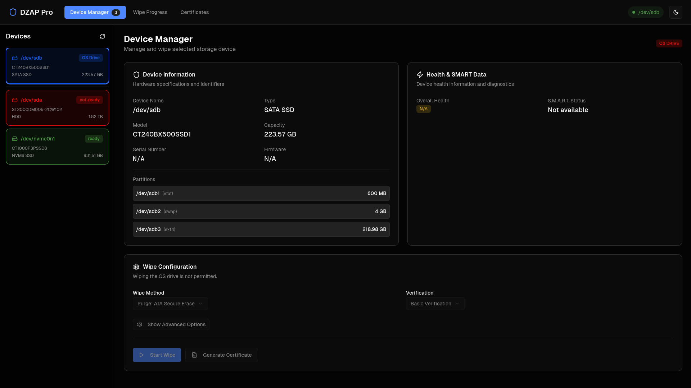
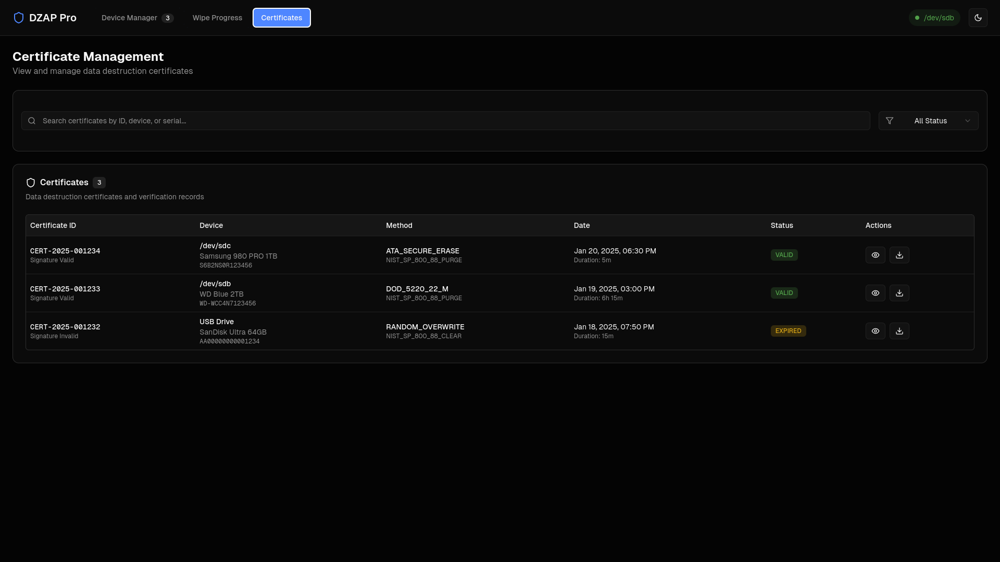

# DZap Live USB

DZap is a bootable Linux environment for recovering data and securely erasing attached storage. It assesses a source read-only, creates a resumable ddrescue image on an identity-bound destination, opens supported encryption read-only, and offers filesystem-aware copy or PhotoRec carving with per-file hash manifests. Its wipe path requires an identity-bound safety preflight, executes device-appropriate ATA, NVMe, or overwrite methods, verifies the result, and exports signed evidence bundles to removable media.

Detailed design, safety, API, live-image, testing, history, and roadmap documentation is available in [`docs/`](docs/README.md).

> [!CAUTION]
> DZap permanently destroys data on the selected storage device. Verify the device identity and every preflight result before authorizing a wipe.

## Screenshots





## Build the bootable image

Builds currently target x86-64 Arch Linux hosts. Install the build tools:

```bash
sudo pacman -S --needed archiso nodejs npm qemu-desktop rustup
rustup default stable
rustup target add x86_64-unknown-linux-musl
```

Build the hybrid BIOS/UEFI ISO:

```bash
make iso
```

The resulting `dzap-*.iso` is written to `out/`. The builder copies ArchISO's installed `releng` profile, replaces its installer entries with immediate DZap boot entries, adds the DZap packages and startup files, exports the frontend, and builds static Rust binaries.

Test the image with a dedicated virtual disk:

```bash
make smoke-iso
make run-iso
```

The smoke test boots the live filesystem and checks its backend, frontend, kiosk account, and boot-device protection. The interactive QEMU launcher creates `build/archiso/test-disk.qcow2`; DZap may safely erase that virtual test disk.

Inside the interactive QEMU window, guest tty2 contains the read-only Rust TUI and tty1 contains the graphical dashboard. If the host intercepts `Ctrl+Alt+F1/F2`, press `Ctrl+Alt+2` to open the QEMU monitor, enter `sendkey ctrl-alt-f2` or `sendkey ctrl-alt-f1`, then press `Ctrl+Alt+1` to return to the guest display. QEMU uses `Ctrl+Alt+G` to release captured keyboard and mouse input. Rebuild with `make iso` after changing packaged source.

Write the hybrid ISO to a USB drive with a trusted imaging tool. Verify the destination carefully because imaging replaces the entire selected device.

## Develop locally

Start the backend as root:

```bash
cd server
cargo build --release
sudo DZAP_FRONTEND_DIR=../frontend/out ./target/release/server
```

For frontend development with hot reload, point the static client at the separately running backend:

```bash
cd frontend
NEXT_PUBLIC_DZAP_SERVER_ORIGIN=http://127.0.0.1:8080 npm run dev
```

Runtime storage tools included in the live image are `util-linux`, `smartmontools`, `hdparm`, and `nvme-cli`.

## Verification

Run the local checks:

```bash
cd server
cargo test
cargo test --all-targets --features tui
cargo clippy --all-targets --features tui -- -D warnings
cd ../frontend
npm run build
npx tsc --noEmit
cd ..
make check-live
make smoke-iso
./server/scripts/e2e-qemu.sh
```
