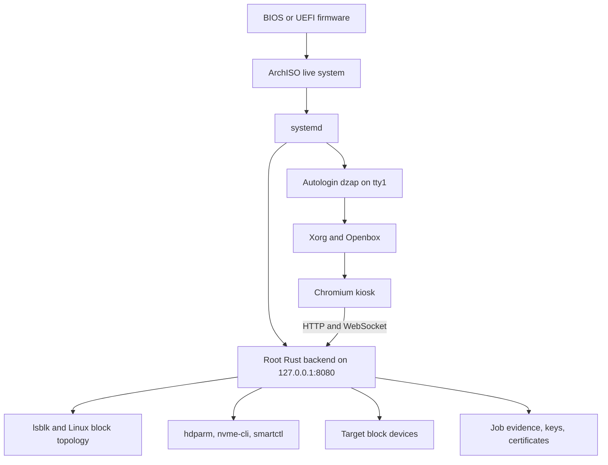

# DZap engineering guide

These documents describe the Rust-based DZap implementation as it exists after the first bootable live-USB milestone. They explain what the system does, why its safety checks exist, what has been tested, and which gaps remain.

The product scope is now an **x86-64 bootable USB appliance**. DZap does not need Electron, a native Windows application, a native macOS application, or an installed Linux desktop application. The live environment boots its own Linux system, starts the privileged Rust backend, and opens the local dashboard in an unprivileged Chromium kiosk.

## Current capability snapshot

DZap currently provides:

- Storage discovery from Linux block topology, including partitions, mounts, RAID/LVM/device-mapper dependencies, transport, serial number, WWN, size, and major/minor device number.
- Explicit protection for the running system and ArchISO boot media.
- A two-step destructive-operation handshake: inspect the device, then submit the exact detected identity when authorizing the wipe.
- Capability-aware ATA Security Erase and NVMe Sanitize selection.
- One-, two-, and three-pass host overwrites for appropriate device classes.
- Full readback verification for host overwrites and firmware-status plus sampled-readback verification for firmware erase operations.
- Persistent, hash-chained wipe job records while the running filesystem remains available.
- RSA-signed JSON and PDF certificates issued only from verified server-owned evidence.
- Backend-owned, hash-manifested evidence bundles for removable FAT32, exFAT, or ext4 media.
- HTTP and WebSocket APIs bound to localhost.
- A static Next.js dashboard served by the Rust backend.
- A hybrid BIOS/UEFI ArchISO image with automatic kiosk startup.
- Unit, integration, destructive virtual-disk, and live-image boot tests.

The largest current product gap is completing evidence persistence across a live-system reboot. The backend can now mount selected removable media and atomically export a validated bundle, while dashboard destination selection and physical USB retention testing remain unfinished.

## How the system fits together

The backend runs as root because raw block access and firmware erase commands require it. Chromium runs as the separate `dzap` user. The backend listens only on loopback, and browser-origin checks restrict API and WebSocket use to the local development and live-USB origins.

## Reading guide

| Document | What it explains |
| --- | --- |
| [Implementation history](implementation-history.md) | The work completed since the Rust migration, organized by milestone and commit. |
| [Architecture](architecture.md) | Processes, privilege boundaries, source layout, runtime data flow, and design decisions. |
| [Safety model](safety-model.md) | Device discovery, protected-media checks, identity binding, preflight rules, reservations, pause, and abort behavior. |
| [Wipe and verification](wipe-and-verification.md) | Supported erase methods, command execution, job state transitions, and verification policies. |
| [Evidence and certificates](evidence-and-certificates.md) | Hash chains, persistence, signatures, JSON/PDF output, startup validation, and trust limitations. |
| [HTTP and WebSocket API](api.md) | Endpoint contracts, example requests, responses, status codes, and event messages. |
| [Live USB](live-usb.md) | ArchISO composition, build process, boot sequence, QEMU use, and physical-media checklist. |
| [Testing](testing.md) | The 95 Rust tests, QEMU suites, what each layer proves, and what remains untested. |
| [Roadmap](roadmap.md) | Remaining work ranked for a bootable-USB product and explicit out-of-scope work. |

## Terms used in these documents

**Preflight** is a read-only evaluation of a requested destructive operation. It returns a structured plan with passed or blocked checks and a detected device identity.

**Authorization preflight** is the second evaluation performed by `POST /api/wipe`. It requires the caller to send back the identity returned by the earlier preflight. A mismatch blocks the wipe.

**Sanitization** is the destructive command or overwrite pass sequence.

**Verification** is the post-sanitization evidence collection step. A successful command without successful verification is not a verified wipe.

**Job evidence** is the server-owned record of authorization, command completion, verification, or failure. Its events form a SHA-256 hash chain.

**Certificate** is a signed projection of a verified job. It does not accept operator-supplied device or completion facts.

## Claims and limits

The method names use `Clear` and `Purge` language to describe the intended sanitization class. The repository is not itself a laboratory certification, a regulatory approval, or proof that every controller implements its firmware commands correctly. Real hardware validation, documented device coverage, operational procedures, and evidence retention are still required before making formal compliance claims.

The current Android discovery code remains in the Rust backend, but no mobile wipe method is exposed because DZap cannot yet prove a completed factory reset. The live-USB product target refers to the platform DZap runs on; it does not turn an unverifiable mobile reset into a supported sanitization method.
