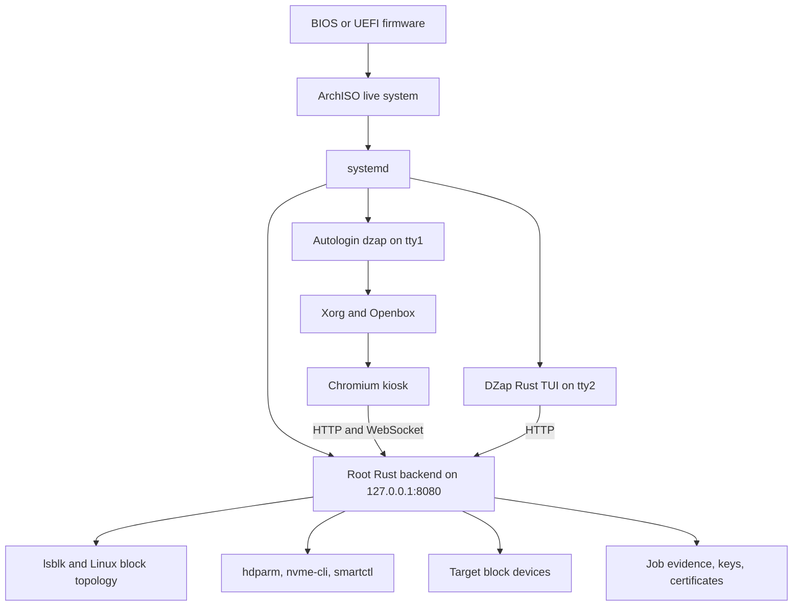

# DZap engineering guide

These documents describe the current Rust-based DZap bootable-USB build. They explain what the system does, why its safety checks exist, what has been tested, and which gaps remain.

The product scope is an **x86-64 bootable USB appliance**. The repository contains no native desktop packaging path. The live environment boots its own Linux system, starts the privileged Rust backend, and opens the local dashboard in an unprivileged Chromium kiosk.

## Current capability snapshot

DZap currently provides:

- Storage discovery from Linux block topology, including partitions, mounts, RAID/LVM/device-mapper dependencies, transport, serial number, WWN, size, and major/minor device number.
- Explicit protection for the running system and ArchISO boot media.
- A two-step destructive-operation handshake: inspect the device, then submit the exact detected identity when authorizing the wipe.
- Capability-aware ATA Security Erase and NVMe Sanitize selection.
- One-, two-, and three-pass host overwrites for appropriate device classes.
- Full readback verification for host overwrites and firmware-status plus sampled-readback verification for firmware erase operations.
- Persistent, hash-chained wipe job records while the running filesystem remains available.
- RSA-signed JSON and PDF certificates issued only from verified server-owned evidence.
- Backend-owned, hash-manifested evidence bundles for removable FAT32, exFAT, or ext4 media.
- HTTP and WebSocket APIs bound to localhost.
- A static Next.js dashboard served by the Rust backend.
- A read-only recovery assessment for signatures, encryption, media damage indicators, and sparse content classification.
- Identity-bound destination selection and resumable ddrescue imaging with persistent progress.
- Read-only image inspection, encrypted-volume access, filesystem copy, PhotoRec carving, and recovered-file hash manifests.
- Autonomous raw-sector forensic carving engine (Scalpel contiguous sliding-window & Garfinkel bi-fragment gap heuristics) with deep JPEG, PNG, and MP4 structural parsers, write-blocking verification, real-time WebSocket telemetry, and tamper-evident Chain of Custody reports (NIST SP 800-86 & ISO/IEC 27037).
- A read-only Rust terminal interface for device inspection and safety preflight on tty2.
- A hybrid BIOS/UEFI ArchISO image with automatic kiosk startup.
- An owner-key Secure Boot build that signs systemd-boot and a unified kernel image containing the kernel, initramfs, and boot command line.
- Unit, integration, destructive virtual-disk, and live-image boot tests.

The software path for evidence persistence is now complete: the dashboard selects removable media, the backend mounts it with restricted options, exports an authenticated bundle, reads it back, and can safely unmount it. Physical USB retention testing and the long-term signing-key trust model remain release requirements.

## How the system fits together

The backend runs as root because raw block access and firmware erase commands require it. Chromium runs as the separate `dzap` user. The backend listens only on loopback, and browser-origin checks restrict API and WebSocket use to the local development and live-USB origins.

For team presentations and design review, open the standalone [system architecture](diagrams/dzap-system.html), [wipe workflow](diagrams/wipe-workflow.html), or [recovery workflow](diagrams/recovery-workflow.html). The files include light/dark themes, selectable views, and export controls without needing a server.

## Reading guide

| Document | What it explains |
| --- | --- |
| [Implementation history](implementation-history.md) | The work completed since the Rust migration, organized by milestone and commit. |
| [Architecture](architecture.md) | Processes, privilege boundaries, source layout, runtime data flow, and design decisions. |
| [Safety model](safety-model.md) | Device discovery, protected-media checks, identity binding, preflight rules, reservations, pause, and abort behavior. |
| [Wipe and verification](wipe-and-verification.md) | Supported erase methods, command execution, job state transitions, and verification policies. |
| [Data recovery](data-recovery.md) | Source assessment, destination planning, interpretation limits, and the image-first recovery pipeline. |
| [Evidence and certificates](evidence-and-certificates.md) | Hash chains, persistence, signatures, JSON/PDF output, startup validation, and trust limitations. |
| [HTTP and WebSocket API](api.md) | Endpoint contracts, example requests, responses, status codes, and event messages. |
| [Live USB](live-usb.md) | ArchISO composition, build process, boot sequence, QEMU use, and physical-media checklist. |
| [Interface options](interfaces.md) | Measured browser/TUI resource tradeoffs and the native-GUI decision. |
| [Testing](testing.md) | The 140 Rust tests, QEMU suites, what each layer proves, and what remains untested. |
| [Roadmap](roadmap.md) | Remaining work ranked for a bootable-USB product and explicit out-of-scope work. |
| [Shareable diagrams](diagrams/README.md) | Standalone architecture, wipe, and recovery visuals plus their editable Archify sources. |

## Terms used in these documents

**Preflight** is a read-only evaluation of a requested destructive operation. It returns a structured plan with passed or blocked checks and a detected device identity.

**Recovery assessment** is a read-only inspection of one recovery source. It reports recognized storage, encryption, damage indicators, and sparse content evidence without authorizing a recovery command.

**Recovery image plan** binds the assessed source to a separate destination identity and verifies mount mode, filesystem limits, and free capacity. Starting a recovery job repeats those checks under reservations before ddrescue runs.

**Recovery result** is one filesystem-copy or PhotoRec attempt performed against the completed image. Its output directory, counts, and per-file manifest digest are bound to the persistent job evidence.

**Authorization preflight** is the second evaluation performed by `POST /api/wipe`. It requires the caller to send back the identity returned by the earlier preflight. A mismatch blocks the wipe.

**Sanitization** is the destructive command or overwrite pass sequence.

**Verification** is the post-sanitization evidence collection step. A successful command without successful verification is not a verified wipe.

**Job evidence** is the server-owned record of authorization, command completion, verification, or failure. Its events form a SHA-256 hash chain.

**Certificate** is a signed projection of a verified job. It does not accept operator-supplied device or completion facts.

## Claims and limits

Method names describe the command or overwrite pattern DZap actually executes. DZap does not assign a sanitization class or make a compliance claim from the command name alone. A verified job proves what this build requested and checked; it does not prove that every controller implements firmware commands correctly. Real hardware validation, documented device coverage, operational procedures, and evidence retention are required before making formal compliance claims.

The current Android discovery code remains in the Rust backend, but no mobile wipe method is exposed because DZap cannot yet prove a completed factory reset. The live-USB product target refers to the platform DZap runs on; it does not turn an unverifiable mobile reset into a supported sanitization method.

The Secure Boot build uses a project-owner key. It authenticates the UEFI boot manager and the unified kernel image after that key is enrolled in firmware. It does not inherit the factory trust found on ordinary consumer machines, and the external ArchISO SquashFS remains outside the UKI signature. The feature is suitable for an enrolled-key demonstration; full root-filesystem integrity, key custody, rotation, and revocation remain release-hardening work.
