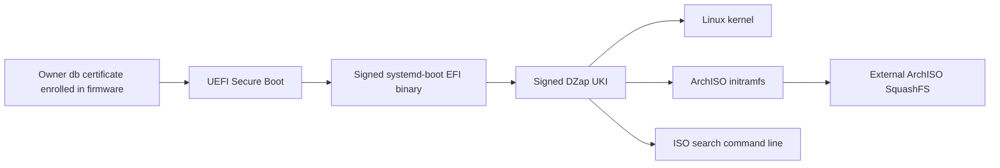
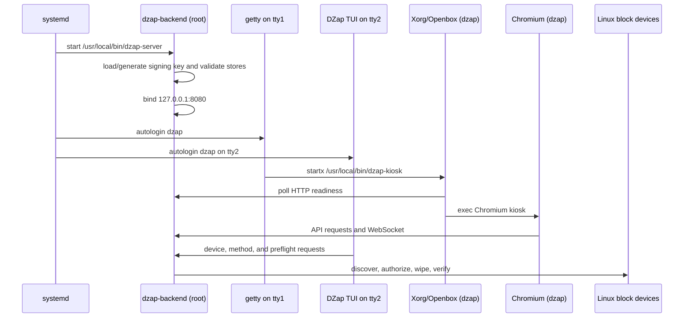

# Architecture

## Product boundary

DZap is designed to boot independently of the installed operating system. This matters because an installed OS normally mounts and actively uses the same storage that an erasure tool needs to inspect or destroy. The live USB provides a known runtime, a controlled root process, and an unprivileged local UI without installing DZap on the machine being serviced.

The current target is x86-64 with both legacy BIOS and UEFI boot entries. Both firmware paths select DZap immediately without presenting ArchISO's installer menu. The optional owner-key Secure Boot build signs the UEFI path; legacy BIOS remains available but does not participate in Secure Boot. The live image is based on ArchISO. The backend is statically linked against musl; the graphical environment and hardware tools come from Arch packages.

## Trusted boot path

The signed build deliberately has one short trust chain:



The UKI binds the Linux kernel, initramfs, operating-system metadata, and ISO search command line into one signed PE image. The build signs the systemd-boot executables with the same owner key and replaces the ordinary split UEFI kernel/initramfs entry with the UKI entry. The public enrollment certificate is published as `dzap-secure-boot.cer` beside the finished ISO. The private key exists only in the host's ignored `build/secure-boot` directory and a temporary root-only profile path during image construction; the image hook removes that path before ArchISO packs the root filesystem.

This boundary authenticates the boot manager and UKI. The root SquashFS is loaded as an external ArchISO artifact and is not covered by that PE signature. Full userspace integrity would require an authenticated root mechanism such as dm-verity plus a root hash bound into the signed UKI. The current implementation makes the demo's boot components verifiable without claiming that stronger property.

## Runtime processes



### Root backend

`dzap-backend.service` runs `/usr/local/bin/dzap-server` as root. Root is required for:

- Opening raw block devices for overwrite and readback.
- Flushing the Linux block cache with `BLKFLSBUF`.
- Running `hdparm` ATA Security commands.
- Running NVMe format and sanitize commands.
- Inspecting and unmounting system block topology.

The service sets `HOME=/root` and `DZAP_FRONTEND_DIR=/opt/dzap/frontend`, works from `/opt/dzap`, restarts on failure, and starts before tty1 login.

### Unprivileged kiosk

The `dzap` system user has UID 1000, shell `/bin/bash`, and a volatile home at `/run/dzap`. Systemd-tmpfiles creates that directory with mode `0700`. tty1 automatically logs in as `dzap`; a profile script starts rootless Xorg on that same virtual terminal.

The kiosk script disables display blanking, starts Openbox, waits up to 60 seconds for the backend, and replaces itself with Chromium. Chromium keeps its cache, configuration, and profile under `/run/dzap`.

This separation prevents the browser renderer from inheriting raw-disk privileges. The browser asks the loopback backend to perform privileged operations through narrow API endpoints.

tty2 runs the `dzap-tui` client as the same unprivileged user. It lists storage, supported methods, and backend preflight checks without exposing wipe authorization. The TUI is a resource and usability prototype; tty1 remains the complete operator interface.

## Backend structure

| Path | Responsibility |
| --- | --- |
| `server/src/main.rs` | Process startup, root check, signing-key initialization, persistent state construction, and loopback listener. |
| `server/src/bin/dzap-tui.rs` | Read-only terminal device browser and preflight client. |
| `server/src/lib.rs` | Shared application state, Axum routes, CORS, allowed UI origins, and static frontend fallback. |
| `server/src/api.rs` | HTTP/WebSocket handlers plus asynchronous wipe, imaging, and file-recovery orchestration. |
| `server/src/core/drives.rs` | Linux block and Android discovery, topology inspection, drive classification, frozen-state probe, and safe unmounting. |
| `server/src/core/evidence_export.rs` | Removable destination discovery/mounting, atomic evidence bundles, manifest hashing, and readback validation. |
| `server/src/core/recovery_plan.rs` | Recovery destination capacity, dual identity binding, source quiescence, and image-plan checks. |
| `server/src/core/recovery_jobs.rs` | Persistent recovery state, artifact binding, map progress, result metadata, and event hash chains. |
| `server/src/core/recovery_imaging.rs` | ddrescue arguments, map parsing, pause/cancel controls, and resumable imaging. |
| `server/src/core/recovery_extract.rs` | Read-only image/crypto mappings, volume discovery, TestDisk, filesystem copy, PhotoRec, and file manifests. |
| `server/src/core/preflight.rs` | Read-only safety decisions and identity-bound authorization. |
| `server/src/core/wiper.rs` | Method selection, reservations, overwrite loops, firmware-command execution, progress, pause, and abort controls. |
| `server/src/core/ata.rs` | ATA capability parsing and safe `hdparm` argument construction. |
| `server/src/core/nvme.rs` | NVMe controller resolution, sanitize capability parsing, command construction, and sanitize-log checks. |
| `server/src/core/verification.rs` | Identity revalidation, full or sampled readback, cache invalidation, and evidence-policy validation. |
| `server/src/core/jobs.rs` | Job state machine, event hash chain, startup validation, and atomic persistence. |
| `server/src/core/certificate.rs` | RSA key management, certificate binding/signing, certificate persistence, QR generation, and PDF generation. |
| `server/src/core/predict.rs` | SMART parsing and optional SATA ONNX prediction. |
| `server/src/realtime.rs` | Broadcast hub for progress and terminal events. |

## Frontend structure

The frontend is a Next.js App Router application exported as static files. It has four main views:

- **Devices** discovers drives, shows health and supported methods, runs preflight, and presents the destructive confirmation dialog.
- **Progress** loads server-owned jobs, listens to WebSocket events, shows verification evidence, supports abort requests, and asks the backend to issue a certificate.
- **Recovery** loads persistent imaging and extraction jobs, shows ddrescue map progress, controls pause/resume/cancel, runs image analysis, obtains ephemeral unlock secrets, and starts filesystem or PhotoRec recovery.
- **Certificates** lists persisted signed certificates, exports individual JSON/PDF files, and writes complete authenticated bundles to selected removable media with a safe-unmount action.

`frontend/lib/utils.ts` is the browser API client. `frontend/lib/types.ts` mirrors backend JSON structures. Reusable visual primitives live under `frontend/components/ui/`.

The browser derives HTTP and WebSocket endpoints from the dashboard's current origin, so the packaged frontend follows whichever permitted loopback hostname opened it. `NEXT_PUBLIC_DZAP_SERVER_ORIGIN` is an explicit build-time override for running the Next.js development server on port 3000 against the backend on port 8080.

## Request and worker flow

Axum handles short HTTP work asynchronously. Blocking system and storage operations are moved into `tokio::task::spawn_blocking` so they do not stall the async runtime.

For a wipe request:

1. The handler re-runs authorization preflight in a blocking worker.
2. It acquires an in-process reservation for the exact device path.
3. It creates and persists the `running` job before starting destruction.
4. A blocking worker performs the sanitization operation.
5. A Tokio task drains progress messages and broadcasts them to WebSocket subscribers.
6. On command success, the job becomes `verifying` and verification runs in a blocking worker.
7. Verified evidence is persisted before the terminal WebSocket event is sent.
8. The reservation is released when the orchestration task ends, including error paths.

For recovery:

1. Assessment opens one reserved whole drive read-only and returns a fresh identity.
2. Planning binds that source identity to a separate removable destination and checks image capacity.
3. Start reserves both whole drives, repeats the checks under those reservations, creates persistent artifacts, and launches ddrescue.
4. Map-file progress is persisted and broadcast; pause, failure, or restart retains a resumable image/map pair.
5. Image inspection reserves and revalidates only the destination because later stages no longer need the physical source.
6. A fresh read-only loop attachment exposes stable volume choices. Encrypted selections receive a temporary read-only cryptsetup mapping from a secret supplied through stdin.
7. Filesystem recovery mounts with read-only, `nodev`, `nosuid`, and `noexec` options. PhotoRec runs directly against the selected image volume.
8. Every recovered regular file is hashed into a JSON-lines manifest, and completion evidence binds that manifest's digest and counts.
9. Temporary mounts, crypto mappings, loop devices, controls, and the destination reservation are released on success and error paths.

WebSocket delivery is advisory UI telemetry. The persistent job record is authoritative. The progress view loads that record on entry and page navigation, reloads it whenever the socket connects, and retries a closed socket with exponential delays capped at ten seconds. Terminal events trigger an immediate single-job reload. This lets a refreshed or temporarily disconnected browser recover status without treating missed WebSocket messages as evidence.

## State and ownership

`AppState` owns four clonable handles:

- A broadcast `Hub`.
- A `JobStore`.
- A `CertificateStore`.
- A `RecoveryJobStore`.

In production startup, both stores use the Linux configuration directory. With `HOME=/root`, the expected paths are:

```text
/root/.config/DZap/private.pem
/root/.config/DZap/jobs/<job-id>.json
/root/.config/DZap/certificates/<job-id>.json
/root/.config/DZap/recovery-jobs/recovery-<id>.json
```

Directories are set to mode `0700`; the key and JSON records are set to `0600`. State transitions are written to a temporary file, synced, atomically renamed, and followed by a directory sync.

The live environment gives `/root` a volatile overlay. These paths survive backend restarts during one boot but not removal or reboot of the live USB. The evidence export API writes validated bundles to selected removable media; its dashboard workflow and physical USB qualification remain part of [the persistence milestone](roadmap.md#p0-persistent-evidence-export).

## Network boundary

The server binds only `127.0.0.1:8080`. It does not expose destructive APIs to the LAN.

The HTTP CORS layer allows GET and POST with `Content-Type` only from explicit loopback dashboard origins. The WebSocket handler independently rejects a present `Origin` header unless it is on the same allowlist. A client without an `Origin` header can still connect; local non-browser tools depend on that behavior.

Static files are served as the router fallback from `DZAP_FRONTEND_DIR`, defaulting to `/opt/dzap/frontend`. API routes take precedence over the static fallback.

## Concurrency controls

There are three related in-process maps:

- `reserved_devices` prevents a second API wipe from starting on a path while sanitization or verification already owns it.
- `active_wipes` stores cancellation and pause flags while the destructive worker is executing.
- `active_controls` stores pause/cancel intent for ddrescue and cancel intent for file recovery.

The reservation covers both destruction and verification. The active-control entry exists only during sanitization. This distinction lets the API reject overlapping work even after the destructive command ends and readback is still running.

These maps are process-local. Backend restart recovery marks nonterminal wipe jobs failed. An interrupted ddrescue job becomes paused because its map is resumable; an interrupted file-recovery attempt becomes failed while retaining its completed image and partial output.

## Build-time composition

The source tree does not copy ArchISO's full `releng` profile into version control. `scripts/build-live-iso.sh` copies the installed profile at build time, overlays DZap files, merges package names, builds the static backend, Rust TUI, and frontend, sets explicit executable permissions, and calls `mkarchiso`.

This avoids carrying a stale fork of ArchISO boot files, but it also means the base image changes with the host's installed ArchISO profile and current package repositories. Pinning and recording this input is part of release hardening.

With `DZAP_SECURE_BOOT=1`, the builder validates the private-key permissions and confirms that the certificate matches it. It adds `sbsigntools` and `systemd-ukify`, stages a root-only pacman hook, and builds a signed UKI after the kernel/initramfs transaction. The hook also signs every packaged systemd-boot EFI executable and deletes its signing inputs. After `mkarchiso` completes, `scripts/verify-secure-iso.py` extracts the ISO's actual EFI system partition and proves that the bootloaders and UKI validate against the requested certificate, that required UKI sections exist, that the published enrollment certificate matches, and that the loader entry cannot fall back to an unsigned split kernel.

## Design decisions worth preserving

- Keep destructive device access in one root backend rather than the browser.
- Keep the UI on loopback and run it as an unprivileged user.
- Re-detect and compare identity at authorization and verification boundaries.
- Treat command completion and wipe verification as separate states.
- Build certificates from server evidence, never client assertions.
- Fail startup on malformed or tampered persisted evidence.
- Hold an exclusive device reservation through verification.
- Keep generated images and working directories out of Git.
- Keep Secure Boot private keys outside the source tree and finished ISO.
