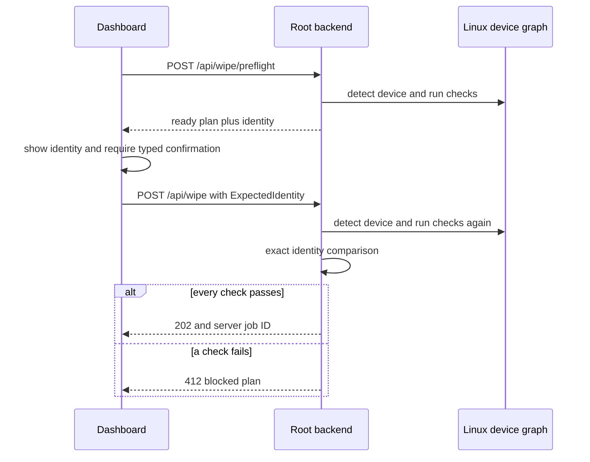

# Safety model

DZap executes irreversible operations, so the safety design assumes that device names can change, user interfaces can become stale, storage stacks can hide dependencies, and firmware commands can fail in awkward intermediate states. The backend makes the final decision at execution time.

## Safety properties implemented today

A wipe cannot start unless all of the following are true:

- The requested device is present during authorization.
- The requested method is valid for the detected device class.
- The device is not the running system or DZap boot media.
- Neither the device nor any discovered child is mounted.
- The device does not back an active RAID, LVM, encrypted, or device-mapper layer.
- A SATA SSD is not security-frozen.
- ATA HPA and DCO capacity probes succeed and show no hidden capacity.
- The selected ATA or NVMe firmware action is advertised by the device.
- The detected identity exactly matches the identity the operator approved.
- No conflicting storage operation currently reserves the same device path.

These checks run in the root backend. Disabling a UI button is only presentation; it is not a safety boundary.

## Device discovery

The backend runs:

```text
lsblk -J -b -o NAME,MODEL,SERIAL,WWN,SIZE,ROTA,TYPE,MOUNTPOINTS,FSTYPE,TRAN,MAJ:MIN
```

It considers top-level `disk` and `rom` records and recursively inspects their children. Each storage response contains:

- Kernel path, such as `/dev/sda` or `/dev/nvme0n1`.
- Model and serial.
- WWN when provided.
- Exact byte size.
- Transport.
- Linux major/minor device number.
- Classified drive type.
- Mount, frozen, and OS-drive flags.
- Active non-partition descendants.
- Direct partition summaries.

Drive classification follows this order:

1. `nbd*` devices are treated as HDDs for the isolated QEMU test path.
2. Devices transported over USB are USB drives.
3. Names beginning with `nvme` are NVMe devices.
4. Rotational devices are HDDs.
5. Remaining block disks are SSDs.

The ordering matters. A flash drive attached over USB must use removable-media policy rather than being treated as a direct SATA SSD merely because it is non-rotational.

## Protected system and boot media

A device becomes an OS drive if it or any descendant is mounted at one of these locations:

```text
/
/boot
/boot/efi
/usr
/var
/run/archiso
/run/archiso/*
```

The `/run/archiso` rule protects the medium from which the live system was loaded. Recursive inspection means a mount on a child partition marks its parent disk as protected.

The unmount endpoint performs its own fresh `lsblk` query and repeats the protected-media decision. It refuses to unmount the running system or DZap boot media. For other devices it attempts each mounted child first, then the top-level device, and returns all unmount failures instead of hiding partial failure.

## Active dependency detection

Every non-partition descendant below a selected disk is recorded as an active dependency. This catches topologies such as:

```text
sdb
└─sdb1 (part)
  └─cryptdata (crypt)
    └─vg-data (lvm)
```

Even if the physical partition itself has no mountpoint, wiping `sdb` would destroy an active logical device. Preflight blocks until those layers are deactivated outside the wipe operation.

## Two-phase identity binding

Linux paths describe slots in the current kernel device graph; they are not durable hardware identities. A USB drive can disappear and another drive can later receive the same `/dev/sdX` name.

DZap addresses this with a two-phase flow:



The identity comparison covers:

| Field | Reason |
| --- | --- |
| `model` | Human-recognizable device family. |
| `serial` | Manufacturer identity when exposed. |
| `wwn` | Storage-network identity when exposed. |
| `sizeBytes` | Detects substitution by differently sized media. |
| `transport` | Detects a changed connection path or class. |
| `majorMinor` | Binds the approval to the kernel device instance observed at preflight. |

The comparison is exact. Missing expected identity blocks authorization. A field changing between preflight and execution requires the operator to inspect and approve the device again.

The confirmation dialog also requires two acknowledgements and exact typed text in the form `WIPE <serial>`. When a storage serial is unavailable, the UI uses the device path for the typed phrase. This reduces accidental clicks, while the backend identity check remains the authoritative control.

## Preflight check reference

| Code | Applies to | Pass condition |
| --- | --- | --- |
| `device_exists` | All targets | The target is present in a fresh discovery result. |
| `method_supported` | All targets | Method ID is offered for the detected device class. |
| `os_drive` | Storage | No protected system/live mount exists on the device tree. |
| `mounted` | Storage | No mountpoint exists on the device or descendants. |
| `active_block_dependencies` | Storage | No non-partition descendant is active. |
| `frozen` | SATA SSD | The ATA Security state is not frozen. |
| `device_identity` | Authorization | Submitted identity exactly equals the newly detected identity. |
| `hpa` | ATA transport | Visible sector count equals the native sector count. |
| `dco` | ATA transport | DCO real maximum equals the HPA native maximum. |
| `ata_security_capability` | ATA erase | The Security feature and requested normal/enhanced mode are advertised. |
| `nvme_sanitize_capability` | NVMe sanitize | The requested action bit is present in controller `sanicap`. |

Read-only preflight omits `device_identity` because its purpose is to produce the identity for approval. Authorization includes it.

## Hidden ATA capacity

Host Protected Areas and Device Configuration Overlays can make part of an ATA disk invisible to ordinary writes. Reporting a complete wipe while capacity remains hidden would be incorrect.

DZap uses `hdparm -N` to compare visible and native sectors and `hdparm --dco-identify` to compare the real maximum against the native value. It blocks when:

- Either command cannot run or cannot be parsed.
- `hdparm` reports an invalid HPA result or failed DCO checksum.
- Visible sectors are fewer than native sectors.
- DCO real maximum exceeds the native capacity.
- The counts are internally inconsistent.

DZap does not automatically modify HPA or DCO. Restoring capacity is a separate recovery operation because it changes device configuration and deserves its own explicit workflow.

## Capability-gated firmware methods

Method lists shown by the API are filtered using live device probes.

For SATA SSDs, `hdparm -I` must contain an ATA Security section. Normal Security Erase requires general security support; Enhanced Security Erase additionally requires the enhanced-erase capability.

For NVMe, DZap derives the controller path from the namespace path, runs `nvme id-ctrl <controller> -o json`, and parses `sanicap`. Crypto, block, and overwrite sanitize appear only when their respective bits are set.

The capability is checked again inside the destructive implementation and during verification. A stale frontend method list cannot bypass it.

## Exclusive device reservation

After authorization and before job creation, the API reserves the exact device path. A second wipe request for that path receives HTTP `409 Conflict`. The reservation remains held through sanitization and verification and is released by Rust's `Drop` cleanup on every orchestration exit path.

The reservation prevents concurrent work inside one backend process. It does not coordinate with unrelated programs or a second DZap backend instance. The live appliance should remain a single-instance environment.

## Command execution boundaries

Firmware commands run through `ionice -c 3`, placing their I/O scheduling in the idle class. stdout and stderr are drained concurrently while the process runs, preventing a child from blocking on full pipes. Diagnostic capture is bounded to 64 KiB per stream.

Cancellation polls every 100 ms. When set, DZap kills and waits for the child command process before returning failure.

ATA password cleanup is deliberately separate. If password setup or erase fails, DZap attempts `--security-disable` with a cancellation token that is never set. An abort cannot suppress the cleanup attempt.

## Pause and abort semantics

Pause is a toggle. Host overwrite loops check the pause flag between 128 KiB writes and sleep in 100 ms intervals while paused. Calling pause again resumes the loop.

Abort sets the cancellation flag. Host overwrites stop between chunks. External command wrappers kill their local child process.

Firmware operations require careful interpretation:

- Killing `nvme --wait` does not guarantee that an NVMe controller has stopped an already accepted sanitize operation.
- Interrupting ATA Security Erase behavior depends on the drive and transport. DZap still attempts password cleanup on reported command failure.
- Pause has no meaningful effect once a firmware erase command is executing because firmware controls the operation.

The current API does not expose these distinctions strongly enough in the UI. Firmware-aware control messaging is listed in the roadmap.

## Fail-closed behavior

DZap blocks rather than guessing when:

- Discovery fails.
- Device identity is absent or changes.
- HPA/DCO state cannot be proven safe.
- Firmware capability output is missing or malformed.
- Verification cannot re-detect the same device.
- A persisted job or certificate fails integrity validation.
- A certificate does not match its job.

## Remaining safety limits

- Physical controller behavior has not yet been validated across a published hardware matrix.
- Device identity can contain empty serial or WWN fields on some bridges; the remaining fields still participate, but a stronger stable-ID policy is desirable.
- In-process reservations cannot detect another destructive utility acting on the same disk.
- Power loss can leave a firmware operation or partial overwrite in an uncertain state; restart records this as failed, not verified.
- The live overlay is volatile. Backend evidence export exists, while dashboard integration and physical-media retention testing are unfinished.
- Android reset remains unsupported because DZap cannot verify completion.
