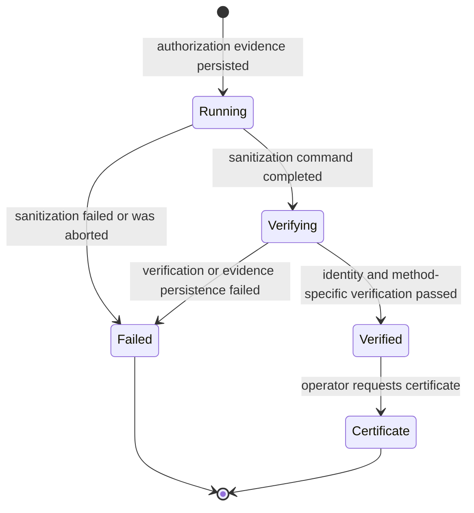

# Wipe and verification pipeline

DZap separates authorization, sanitization, verification, evidence persistence, and certification. A command returning exit code zero means only that sanitization reported success; it does not make the job verified.

## Job lifecycle



The state names in JSON are `running`, `verifying`, `verified`, and `failed`. Pause is an in-memory control flag, not a persisted job state. A backend restart converts any persisted `running` or `verifying` job to `failed` with an interruption event.

## Method selection

| Device class | Method ID | Sanitization action | Final host-visible pattern | Verification |
| --- | --- | --- | --- | --- |
| HDD | `overwrite_1_pass` | One full pass of `0x00` | `0x00` | Full pattern readback. |
| HDD | `overwrite_3_pass` | Full passes of `0x00`, `0xFF`, `0x55` | `0x55` | Full pattern readback. |
| USB/removable | `overwrite_2_pass` | Full pass `0x55`, then complement `0xAA` | `0xAA` | Full pattern readback. |
| SATA SSD | `sata_secure_erase` | ATA Security Erase Unit | Firmware-defined | ATA security state plus sampled readback. |
| SATA SSD | `sata_secure_erase_enhanced` | ATA Enhanced Security Erase Unit | Firmware-defined | ATA security state plus sampled readback. |
| SATA SSD | `overwrite_1_pass` | One full pass of `0x00` | `0x00` | Full pattern readback; UI warns about flash remapping. |
| NVMe | `nvme_sanitize_crypto` | Controller crypto-erase sanitize | Firmware-defined | Sanitize log, identify/health data, sampled readback. |
| NVMe | `nvme_sanitize_block` | Controller block-erase sanitize | Firmware-defined | Sanitize log, identify/health data, sampled readback. |
| NVMe | `nvme_sanitize_overwrite` | Controller overwrite sanitize | Firmware-defined | Sanitize log, identify/health data, sampled readback. |
| NVMe | `nvme_format` | `nvme format -s 1` | Firmware-defined | Namespace identify/health data plus sampled readback. |
| NVMe | `overwrite_1_pass` | One full pass of `0x00` | `0x00` | Full readback; UI warns about wear-leveling and over-provisioning. |

The method list is first determined by device class and transport, then reduced by live firmware capability probes. An ATA SSD behind a transport not reported as `ata`, `ide`, or `sata` receives only overwrite. A controller that does not advertise a sanitize action does not receive that action.

The labels `Clear` and `Purge` express intended method category. They do not replace hardware qualification or an organizational media-sanitization policy.

## Host overwrite implementation

Each pass:

1. Opens the approved device path for writing.
2. Seeks to the end to obtain the current extent.
3. Seeks back to zero.
4. Writes 128 KiB chunks until the entire extent is covered.
5. Checks pause and cancellation between chunks.
6. Calls `sync_all` before reporting the pass complete.

The final partial chunk is shortened to the exact remaining byte count, so regular-file tests prove that an odd-sized target is not extended. A zero-byte write is an error. Unexpected EOF or a platform error containing “no space left on device” is treated as reaching the block-device end, matching the practical behavior of some raw devices.

Progress JSON is emitted at most every 500 ms and after each pass. It contains the device, method, pass, total passes, overall percentage, approximate MiB/s, ETA, and bytes written in the `sectorNumber` compatibility field.

## ATA Security Erase

Before execution, `hdparm -I` is parsed to confirm the exact requested capability. The normal path is:

```text
hdparm --user-master u --security-set-pass dZap <device>
hdparm --user-master u --security-erase dZap <device>
```

Enhanced mode changes the second operation to:

```text
hdparm --user-master u --security-erase-enhanced dZap <device>
```

`dZap` is a temporary operation password rather than a user credential. If setting the password or issuing erase returns an error, DZap independently attempts:

```text
hdparm --user-master u --security-disable dZap <device>
```

The final error records whether cleanup succeeded or failed. Successful erase proceeds to verification, which requires the ATA Security section to report both `not enabled` and `not locked`.

## NVMe operations

For sanitize, DZap converts a namespace such as `/dev/nvme0n1` or a controller-interface namespace into `/dev/nvme0`, probes `sanicap`, and constructs:

```text
nvme sanitize /dev/nvme0 --sanact=<action> --wait [--preq]
```

Action codes are:

- `0x04` for crypto erase.
- `0x02` for block erase.
- `0x03` for overwrite.

`--preq` is added only when the controller advertises purge reporting. Verification reads the raw sanitize log and checks:

- Successful completion status.
- Progress equals `0xffff`.
- Logged action matches the requested action.
- Purge request and purged status bits when purge reporting was requested.

NVMe Format uses:

```text
nvme format <namespace> -s 1
```

It is verified separately from sanitize because its status evidence comes from namespace identification and SMART/health output rather than the sanitize status log.

## Identity revalidation

Before any readback strategy, verification discovers storage again and locates the original path. The full identity must still match the identity approved at preflight. A missing device, changed identity, invalid approved size, or zero-length device fails the job.

Every accepted `VerificationResult` has `identityRevalidated: true`. The job store validates this field again before allowing the terminal `verified` transition.

## Full overwrite readback

For host overwrites, DZap reads every approved byte and verifies each byte against the expected final pattern. It also computes SHA-256 across the bytes read.

After the approved extent, it attempts to read one additional byte. If data exists, the current device is larger than the identity approved before destruction and verification fails.

For Linux block devices, DZap issues `BLKFLSBUF` before reading. This flushes dirty buffers and invalidates cached block data so verification is based on a fresh device read. Failure to flush the block cache fails verification.

The recorded strategy is `full_pattern_readback`, with `bytesChecked` equal to the approved device size and `expectedPattern` set to the final byte.

## Firmware-operation readback

Firmware methods do not guarantee a single host-visible byte pattern, so DZap does not invent one. It reads up to 64 KiB at three deterministic locations:

- Beginning of the device.
- Middle of the device.
- End of the device.

Offsets are deduplicated on very small devices. The readback hash incorporates each offset followed by its sample bytes, so reordered samples produce a different digest.

The expected byte count is validated from device size and sample count. Firmware methods also require a separate SHA-256 over their status material:

- ATA: complete `hdparm -I` output.
- NVMe Format: `id-ns` plus `smart-log` output.
- NVMe Sanitize: raw sanitize log plus `id-ns` and `smart-log` output.

The raw firmware output is not currently embedded in the certificate; its digest is. This proves consistency with the evidence collected by that run but limits later independent interpretation of controller fields. Exporting a richer evidence bundle is planned.

## Evidence policy validation

The job store refuses a verification result that does not match the method policy. It checks:

- Strategy name.
- Exact `bytesChecked` value.
- Expected final pattern for host overwrites.
- Presence or absence of firmware-status hash.
- SHA-256 formatting.
- Identity-revalidation flag.

Only after those checks pass does it append the `verification_completed` event and persist `verified` state.

## Failure behavior

Sanitization errors, aborts, verification errors, worker panics, and persistence failures produce terminal failure handling. A failure event records the message and becomes the final evidence hash.

There is one important distinction: if physical sanitization and verification succeed but final evidence persistence fails, the WebSocket reports failure because DZap cannot truthfully present the operation as an evidenced verified job.

## Current operational limitations

- Firmware correctness ultimately depends on the controller and needs real-device qualification.
- Sampled readback detects obvious accessibility and data-state problems but is not full-media readback.
- Firmware-status raw material is hashed but not yet exported as a standalone evidence attachment.
- A killed NVMe CLI process does not prove that controller sanitize stopped.
- Jobs are not resumed after backend restart; unfinished jobs become failed.
- Android has no verification strategy and therefore no exposed method or certificate path.
